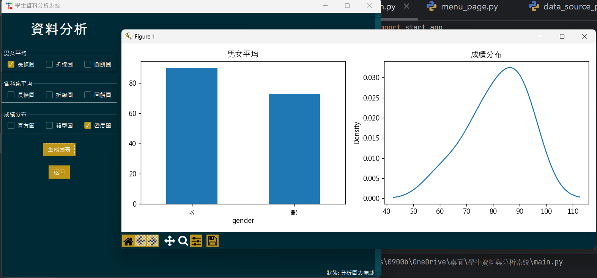

# Student Data Analysis System

Python GUI application for student data analysis.

## Features

- Import CSV / Excel data
- Student score query
- Score ranking
- Data visualization (bar chart, line chart, histogram, boxplot, KDE)

## Technologies

- Python
- Pandas
- Matplotlib
- Tkinter
- SQLite
- 
## Screenshot



## To Fix / Improvements

- Improve generate data module
- Add more flexible data generation options
- Improve error handling when generating data

## How to Run

```bash
python main.py
